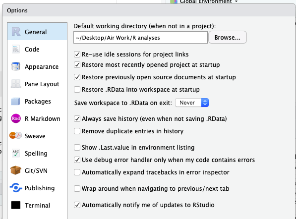
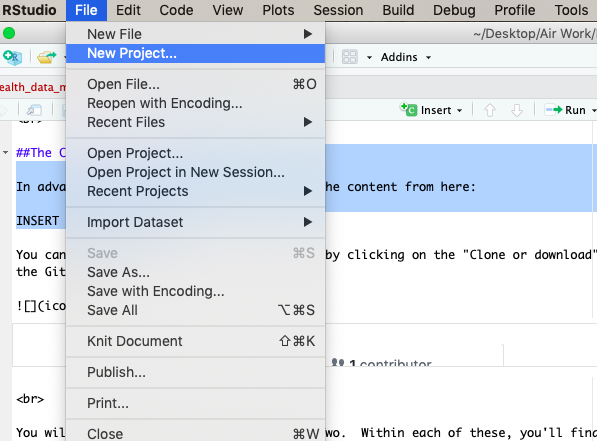
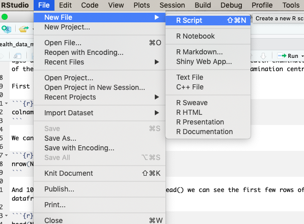

```{r setup, include=FALSE}
knitr::opts_chunk$set(echo = TRUE)
```

You're going to have a go at building your own script using RStudio and doing some data wrangling and visualisation of a dataset.

If this is your first time using RStudio, remember to check the Preferences window and ensure you have _unchecked_ the restore .RData to workspace at startup option and have selected _never_ for Save Workspace to .RData on exit
<br>
<br>
 
<br>
<br>
Before you start, remember to make a new project file - call it something like "workshop_1".  Save the project folder somewhere sensible (maybe create a new folder called something like
R analyses) - the script that you write and any data that you save or want to import should be in the folder associated with your project.  
<br>
<br>
 
<br>
<br>
We're going to use a couple of packages - the Tidyverse packages, the gganimate package, and the NHANES package (which contains the NHANES dataset you're going to use).  If you haven't used or installed these packages yet, you need to do that first by typing into the console:

```{r, eval=FALSE}
install.packages("tidyverse")
install.packages("gganimate")
install.packages("NHANES")
```

You only ever have to do this installation once - unless you update R.  Packages themselves update regularly - the easiest way to check whether you're running the most up to date versions is by clicking on "Packages"" in the right hand pane - then click on "Update".  This will give you the option to update individual packages, or all of them.

To begin with, you need to select a new R Script under the File -> New File menu option (see below). You're going to write all of the following R coded in that script window.
<br>
<br>
 
<br>
<br>
```{r, message=FALSE, warning=FALSE}
library(tidyverse)
library(NHANES)
```

We're going to start by using the NHANES dataset. This is survey data collected by the US National Center for Health Statistics (NCHS) which has conducted a series of health and nutrition surveys since the early 1960s. Since 1999 approximately 5,000 individuals of all ages are interviewed in their homes every year and complete the health examination component of the survey. The health examination is conducted in a mobile examination centre (MEC). 

First we're going to explore the NHANES dataset.

```{r}
colnames(NHANES)
```

We can see there are 76 columns of data.

```{r}
nrow(NHANES)
```

And 10,000 rows.  If we use the function `head()` we can see the first few rows of the dataframe.

```{r}
head(NHANES)
```

It looks like some participants appear more than once in the dataset - the first few rows are all for participant ID 51624 - so looks like there is duplicate data. We can use the `select()` function alongwith the `n_distinct()` function to tell us the unique number of IDs in the dataset. 

```{r}
NHANES %>% 
  select(ID) %>% 
  n_distinct()
```

We see we have 6,779 unique individuals.  Let's tidy our data to remove duplicate IDs. Note that below we're using the pipe operator `%>%`  You can read it as 'and then' so it means we're taking the NHANES dataset and then filtering it keep just rows with distinct ID numbers.  The pipe operator really helps with the readability of your data wrangling code and is an integral part of the tidyverse philosophy - tidy data and tidy code.

```{r}
NHANES_tidied <- NHANES %>% 
  distinct(ID, .keep_all = TRUE)
```

```{r}
nrow(NHANES_tidied)
NHANES_tidied
```

OK, so our tidied dataset is assigned to the variable NHANES_tidied and has 6,779 rows - as we'd expect given we have 6,779 unique individuals.

Let's start exploring the data.  We have lots of potential variables and relationships to explore.  I see we have one labelled `Education` which is coded as a factor.  We also have information related to health such as BMI - first of all lets plot a histogram of BMI.

```{r, warning=FALSE}
NHANES_tidied %>%
  ggplot(aes(x = BMI)) + 
  geom_histogram(bins = 100, na.rm = TRUE)
```

We see a pretty right skewed distribution here. Note our first use of the na.rm parameter - this parameter appears in many tidyverse functions and by setting it to TRUE we tell R to ignore any parts of our dataframe where we have missing data (which is indicated by NA).

Does BMI vary as a function of Education level? In the code below we are using the data stored in the variable NHANES_tidied, grouping it by Education, then summarising to generate the median BMI for each of our groups.  Again, we use the `na.rm = TRUE` parameter with the `summarise()` function this time to remove any missing values (NA) from our calculation.  

```{r, warning=FALSE}
NHANES_tidied %>% 
  group_by(Education) %>% 
  summarise(median = median(BMI, na.rm = TRUE))
```

So it looks like those with College eduction have the lowest median BMI (ignoring the NA category which corresponds to cases where we don't have Education level recorded).  

Let's graph it!  Note here we're filtering out cases where we don't have BMI value recorded.  The function `is.na()` returns TRUE when applied to a case of missing data (NA) - we use the `!` operator to negate this and combine several of these expressions together using the logical AND operator `&`. 

The line of code below starting with `filter()` means filter cases where Education is not missing AND BMI is not missing. This means that the NHANES_tidied data that gets passed to the `ggplot()` call has no missing data for the key variables we're interested in.  

I then add a `geom_boxplot()` layer to create a boxplot for each level of our Education factor - and I'm arranging the order in which they're displayed by using the `fct_reorder()` function to do the re-ordering based on the median BMI for the factor Education. 

The `guides(colour = FALSE)` call supresses displaying the colour legend - delete it and rerun the code to see what changes.

```{r, warning=FALSE}
NHANES_tidied %>% 
  filter(!is.na(Education) & !is.na(BMI)) %>%
  group_by(Education) %>% 
  ggplot(aes(x = fct_reorder(Education, BMI, median), y = BMI, colour = Education)) +
  geom_violin() +
  geom_jitter(alpha = .2, width = .1) +
  geom_boxplot(alpha = .5) +
  guides(colour = FALSE) + 
  labs(title = "Examining the effect of education level on median BMI", 
       x = "Education Level", 
       y = "BMI")
```

We can also plot histograms of BMI separately for each Education level - we use the `facet_wrap()` function to do this.

```{r}
NHANES_tidied %>% 
  filter(!is.na(Education) & !is.na(BMI)) %>%
  group_by(Education) %>% 
  ggplot(aes(x = BMI, fill = Education)) +
  geom_histogram() +
  guides(fill = FALSE) + 
  labs(title = "Examining the effect of education level on BMI",
       x = "BMI", 
       y = "Number of cases") + 
  facet_wrap(~ Education)
```

In the above graph, notice that the same y-axis scale is used for each plot - this makes comparisons a little tricky as there are different numbers of cases for each Eduction level. Add the following `scales = "free"` after `Education` in the facet_wrap line. What changes?

Instead of generating the histograms using a count, we could generate them using a density function. Let's also add a density curve.

```{r, warning=FALSE}
NHANES_tidied %>% 
  filter(!is.na(Education) & !is.na(BMI)) %>%
  group_by(Education) %>% 
  ggplot(aes(x = BMI, fill = Education)) +
  geom_histogram(aes(y = ..density..)) +
  geom_density(aes(y = ..density..)) +
  guides(fill = FALSE) + 
  labs( title = "Examining the effect of education level on BMI", 
        x = "BMI", 
        y = "Density") + 
  facet_wrap(~ Education)
```

What about whether people are working or not? 

```{r, warning=FALSE}
NHANES_tidied %>% 
  group_by(Work) %>% 
  summarise(median = median(BMI, na.rm = TRUE))
```

Here, numerically at least, people who are working have the lowest median BMI.  We could now combine our two `group_by()` calls into one:

```{r, warning=FALSE}
NHANES_tidied %>% 
  group_by(Education, Work) %>% 
  summarise(median = median(BMI, na.rm = TRUE))
```

This is a little hard to read so let's do a couple of things, first we're going to filter out cases of missing data indicated by NA - we need to do that both for the `Education` variable and for the `Work` variable.

```{r, warning=FALSE}
NHANES_tidied %>% 
  filter(!is.na(Education) & !is.na(Work)) %>%
  group_by(Education, Work) %>% 
  summarise(median = median(BMI, na.rm = TRUE))
```

So now we only have levels of each of our two factors where we have data - but the order in which they're presented isn't helpful - let's order such that we go from highest median BMI to lowest - we use the `arrange()` function to arrange by descending median values.

```{r, warning=FALSE}
NHANES_tidied %>% 
  filter(!is.na(Education) & !is.na(Work)) %>%
  group_by(Education, Work) %>% 
  summarise(median = median(BMI, na.rm = TRUE)) %>%
  arrange(desc(median))
```

So we see those with highest median BMI have Some College Education, and are looking for work, while those with lowest have College Grad education and are in work.

Let's graph it!  Note here we're again filtering out cases where we don't have BMI value recorded. The line of code below starting with `filter()` means filter cases where Education is not missing AND Work is not missing AND BMI is not missing. This means that the NHANES_tidied data that gets passed to the `ggplot()` call has no missing data for any of the key variables we're interested in.  

Again I am adding a `geom_boxplot()` layer to create a box plot for each combination of our factors Education and Work - and I'm arranging the order in which they're displayed by using the `fct_reorder()` function to do the re-ordering based on the median BMI for each combination of factors.  I then use the `coord_flip()` function to flip the x and y-axes to make the graph more readable.

```{r, warning=FALSE}
NHANES_tidied %>% 
  filter(!is.na(Education) & !is.na(Work) & !is.na(BMI)) %>%
  ggplot(aes(x = fct_reorder(Education:Work, BMI, median), 
             y = BMI, 
             colour = Education:Work)) + 
  geom_boxplot() + 
  coord_flip() +
  guides(colour = FALSE) + 
  labs(title = "Examining the effect of education level and employment \nstatus on BMI",
       x = "Education X Working", 
       y = "BMI")
```

As we've reordered based on the median BMI, it's a little hard to see any patterns as we have two factors involved in that reordering - Education and Work.  So let's simplify and look at Work status first (reordering on the basis of median BMI). We can see that the highest median BMI group are those looking for work (and the lowest those in work). 

```{r, warning=FALSE}
NHANES_tidied %>% 
  filter(!is.na(Education) & !is.na(Work) & !is.na(BMI)) %>%
  ggplot(aes(x = fct_reorder(Work, BMI, median), 
             y = BMI, 
             colour = Work)) + 
  geom_boxplot() + 
  coord_flip() +
  guides(colour = FALSE) + 
  labs(title = "Examining the effect of employment status on BMI",
       x = "Working", 
       y = "BMI")
```

Now let's look at Education on BMI. Now we say that the lowest median BMI group are those who are college graduates.

```{r, warning=FALSE}
NHANES_tidied %>% 
  filter(!is.na(Education) & !is.na(Work) & !is.na(BMI)) %>%
  ggplot(aes(x = fct_reorder(Education, BMI, median), 
             y = BMI, 
             colour = Education)) + 
  geom_boxplot() + 
  coord_flip() +
  guides(colour = FALSE) + 
  labs(title = "Examining the effect of education level on BMI",
       x = "Education",
       y = "BMI")
```

What about separate plots by race?  Let's first check how many values we have for the `Race1` variable.

```{r}
NHANES_tidied %>%
  select(Race1) %>%
  distinct()
```

OK, let's filter out the Other race category and plot BMI first as a function of Race. For the last bit of the filter we use the  operator `!=` which means "not equal to" - so the last bit of the filter expression means AND (&) Race1 is not equal to "Other".

```{r, warning=FALSE}
NHANES_tidied %>% 
  filter(!is.na(Education) & !is.na(Work) & !is.na(BMI) & Race1 != "Other") %>%
  ggplot(aes(x = fct_reorder(Race1, BMI, median), 
             y = BMI, 
             colour = Race1)) +
  geom_boxplot() + 
  guides(colour = FALSE) +
  labs(title = "Examining Race and BMI",
       x = "Race", 
       y = "BMI") 
```

What else might influence BMI?  Instead of just looking at Race, might there be Gender differences?  Have a go yourself redoing the above but exploring the question of how Gender instead might interact with Education level and Employment status to influence BMI. What about looking at Race AND Gender together? You can do that by changing the last line of the code above to: `facet_wrap(~ Race1:Gender)`

What else might be worth exploring in the NHANES dataset?

Finally, we're going to create some animated graphs using the gganimate package. 

```{r}
library(gganimate)
```

You might also need to install the gifski and png packages if you haven't done so:

```{r, eval=FALSE}
install.packages("gifski")
install.packages("png")
```

First we're going to plot some histograms of BMI animated by age decade. We use the `transition_states()` function to define the operation of our animate with the `ease_aes()` function defining how we transtition from one frame to the next.

```{r}
NHANES_tidied %>%
  filter(!is.na(BMI) & !is.na(AgeDecade)) %>%
  ggplot(aes(x = BMI)) + 
  geom_histogram(bins = 100) +
  transition_states(AgeDecade, transition_length = 2, state_length = 2) +
  ease_aes("linear") + 
  labs(title = "Age decade: {closest_state}")
```

Now we're going to plot some BMI by Education level violin and box plots animated by Race. 

```{r}
NHANES_tidied %>% 
  filter(!is.na(Education) & !is.na(BMI)) %>%
  group_by(Education) %>% 
  ggplot(aes(x = fct_reorder(Education, BMI, median), y = BMI, colour = Education)) +
  geom_violin() +
  geom_boxplot(alpha = .5) +
  guides(colour = FALSE) + 
  labs(title = "Examining the effect of education level on median BMI for Race = {closest_state}",
       x = "Education Level", 
       y = "BMI") +
  transition_states(Race1, transition_length = 2, state_length = 2) +
  ease_aes("linear") 
```

These graphs are great as they can be saved as animated gif files and then used in presentations. To save the last animated plot you built, you can use the `anim_save()` function such as `> anim_save(filename = "my_plot.gif")`
